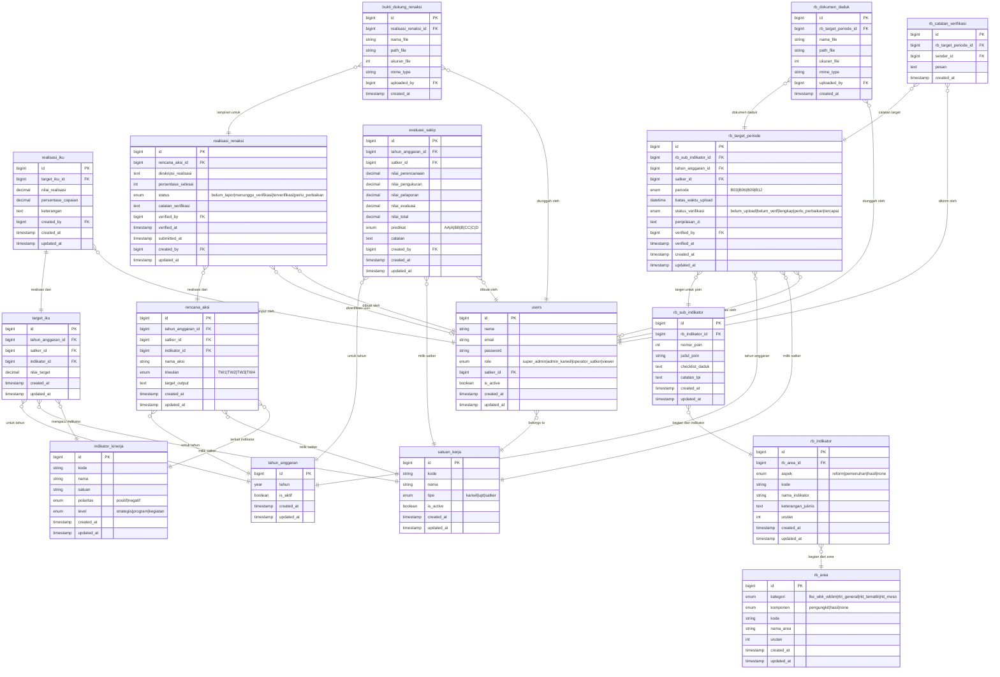

# Entity Relationship Diagram (ERD) & Skema Data BAKAYUH
## Sistem Terpadu Akuntabilitas Kinerja (E-Performance) & Reformasi Birokrasi (E-RB)
### Kantor Wilayah Kementerian Hukum Kalimantan Selatan

**Versi:** v0.3 — Integrasi Penuh E-Performance & E-RB | **Tanggal:** 5 Oktober 2026

---

## Entity Relationship Diagram (ERD)

---

## Ringkasan Struktur Tabel & Relasi

### 1. Entitas Bersama (Core & Shared)
* **`users`**: Akun pengguna sistem dengan peran `super_admin`, `admin_kanwil`, `operator_satker`, `viewer`.
* **`satuan_kerja`**: Master Satker (Kanwil, Lapas, Rutan, Bapas, Kanim, Rupbasan, BHP).
* **`tahun_anggaran`**: Periode tahun anggaran aktif.

### 2. Entitas Pilar E-Performance (Akuntabilitas Kinerja)
* **`indikator_kinerja`**: Master IKU (kode, nama, satuan, polaritas, level).
* **`target_iku`**: Penetapan target per satker per tahun anggaran.
* **`realisasi_iku`**: Realisasi capaian IKU oleh operator satker.
* **`rencana_aksi`**: Rencana aksi triwulanan (TW I–IV) terhubung IKU.
* **`realisasi_renaksi`**: Pelaporan realisasi, progres %, dan status persetujuan.
* **`bukti_dukung_renaksi`**: File lampiran pendukung laporan realisasi Renaksi.
* **`evaluasi_sakip`**: Nilai evaluasi 4 komponen SAKIP (Perencanaan, Pengukuran, Pelaporan, Evaluasi) dan predikat.

### 3. Entitas Pilar E-RB (Reformasi Birokrasi & ZI)
* **`rb_area`**: Master Area LKE WBK/WBBM (6 Area Pengungkit + 2 Area Hasil) & RKT RB (General, Tematik, Meso).
* **`rb_indikator`**: Indikator per area dengan filter aspek (`reform`, `pemenuhan`, `hasil`).
* **`rb_sub_indikator`**: Poin indikator rinci, checklist persyaratan berkas data dukung, petunjuk TPI.
* **`rb_target_periode`**: Pemetaan satker + poin indikator + target periodik (`B03`, `B06`, `B09`, `B12`) + batas waktu + status verifikasi + narasi penjelasan ZI.
* **`rb_dokumen_daduk`**: Berkas PDF data dukung yang diunggah satker (maks. 50MB, auto-lock jika lengkap).
* **`rb_catatan_verifikasi`**: Log percakapan/catatan klarifikasi dua arah antara verifikator dan operator.

---

## Matriks Hak Akses Peran (RBAC)

| Modul / Fitur | Super Admin | Admin Kanwil | Operator Satker | Viewer | Publik |
| :--- | :---: | :---: | :---: | :---: | :---: |
| **Manajemen Pengguna** | ✅ Full | ❌ | ❌ | ❌ | ❌ |
| **Master Data (Satker, Tahun, IKU, RB)** | ✅ Full | ✅ Full | ❌ | ✅ Read | ❌ |
| **IKU (Target & Realisasi)** | ✅ Full | ✅ Full | ✅ (Satker sendiri) | ✅ Read | ❌ |
| **Renaksi (Pelaporan TW I–IV)** | ✅ Full | ✅ Full | ✅ (Satker sendiri) | ✅ Read | ❌ |
| **Verifikasi Renaksi** | ✅ Full | ✅ Full | ❌ | ✅ Read | ❌ |
| **Evaluasi SAKIP (4 Komponen)** | ✅ Full | ✅ Full | ❌ | ✅ Read | ❌ |
| **LKE WBK/WBBM (Upload Daduk B03–B12)** | ✅ Full | ✅ Full | ✅ (Satker sendiri) | ✅ Read | ❌ |
| **RKT RB General/Tematik/Meso** | ✅ Full | ✅ Full | ✅ (Satker sendiri) | ✅ Read | ❌ |
| **Verifikasi Daduk & Kunci Berkas** | ✅ Full | ✅ Full | ❌ | ❌ | ❌ |
| **Thread Catatan Klarifikasi Daduk** | ✅ Full | ✅ Full | ✅ (Satker sendiri) | ❌ | ❌ |
| **Dashboard Terpadu (Kinerja + RB)** | ✅ Full | ✅ Full | ✅ Read | ✅ Read | ❌ |
| **Portal Transparansi Publik** | ✅ | ✅ | ✅ | ✅ | ✅ |
