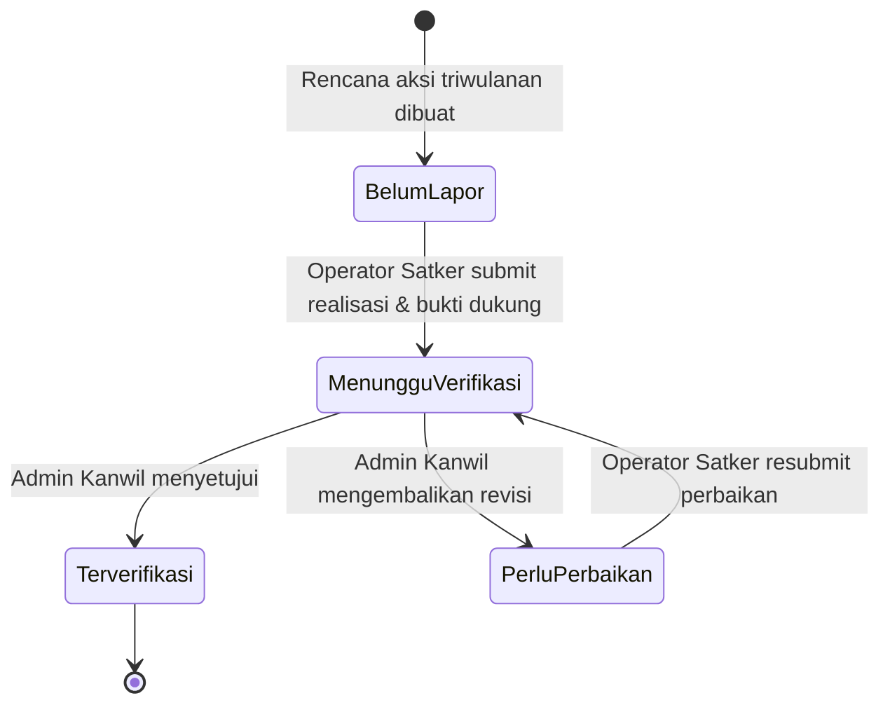
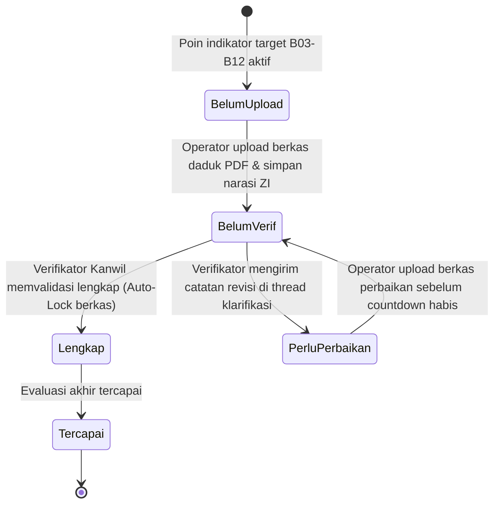

# PRODUCT REQUIREMENTS DOCUMENT (PRD)

## BAKAYUH — Sistem Terpadu Akuntabilitas Kinerja (E-Performance) & Reformasi Birokrasi (E-RB)
### Kantor Wilayah Kementerian Hukum Kalimantan Selatan
*(Basis Akuntabilitas Kanwil untuk meningkatkan kinerja Yang Unggul dan Harmonis)*

**STATUS: DRAFT GABUNGAN v0.3 (E-Performance + E-RB)**

| | |
| --- | --- |
| **Nama Produk** | BAKAYUH — Basis Akuntabilitas Kanwil untuk meningkatkan kinerja Yang Unggul dan Harmonis |
| **Versi Dokumen** | v0.3 (Integrasi Lengkap E-Performance & E-RB Kemenkum) |
| **Disusun oleh** | Tim Pengembang |
| **Untuk** | Kantor Wilayah Kementerian Hukum Kalimantan Selatan |
| **Tanggal** | 5 Oktober 2026 |
| **Dokumen Terkait** | - Portal Transparansi Kinerja Kemenkum: https://performance.kemenkum.go.id/<br>- Aplikasi E-RB Kemenkum: https://erb.kemenkum.go.id/ |

---

# 1. Ringkasan Produk (Overview)

Kantor Wilayah Kementerian Hukum Kalimantan Selatan (Kanwil Kemenkum Kalsel) membina dan mengawasi seluruh Satuan Kerja / Unit Pelaksana Teknis (UPT) se-Kalimantan Selatan dalam dua pilar strategis utama:
1. **Akuntabilitas Kinerja Organisasi (E-Performance / SAKIP):** Pemantauan Indikator Kinerja Utama (IKU), pelaporan Rencana Aksi Perjanjian Kinerja (Renaksi PK), dan evaluasi Sistem Akuntabilitas Kinerja Instansi Pemerintah (SAKIP).
2. **Pembangunan Reformasi Birokrasi & Zona Integritas (E-RB / ZI):** Pelaksanaan Rencana Kerja Tahunan Reformasi Birokrasi (RKT RB General, Tematik, Meso) dan pemenuhan Lembar Kerja Evaluasi (LKE) Zona Integritas menuju Wilayah Bebas dari Korupsi (WBK) / Wilayah Birokrasi Bersih dan Melayani (WBBM).

Sebelumnya, pengelolaan kedua pilar tersebut mengacu pada dua sistem nasional terpisah (*performance.kemenkum.go.id* dan *erb.kemenkum.go.id*) yang bersifat makro nasional dan tidak memberikan ruang pemantauan internal, verifikasi berjenjang, maupun fasilitas asistensi khusus di tingkat Kanwil Kalsel.

**BAKAYUH** hadir sebagai satu aplikasi web tunggal terpadu berbasis **Laravel (backend API)** dan **Vue 3 Composition API + TypeScript (frontend SPA)** yang menggabungkan seluruh fitur **E-Performance** dan **E-RB** dalam satu platform terpusat bagi pimpinan, verifikator Kanwil, dan operator satker se-Kalsel.

---

# 2. Tujuan & Sasaran (Goals)

- **Single Platform Kinerja & RB:** Menggabungkan pemantauan IKU, Renaksi PK, Evaluasi SAKIP, RKT RB (General/Tematik/Meso), dan LKE WBK/WBBM dalam satu dashboard terintegrasi.
- **Efisiensi Pelaporan & Verifikasi Berjenjang:** Menyederhanakan alur input target, realisasi, dan data dukung (daduk) dari Satker UPT ke Tim Verifikator Kanwil Kalsel.
- **Standarisasi Bukti Dukung (Daduk):** Menyediakan checklist bukti dukung terstruktur, countdown batas waktu upload (B03, B06, B09, B12), batasan berkas PDF s.d. 50MB, dan proteksi penguncian data (auto-lock saat terverifikasi).
- **Komunikasi Dua Arah (Catatan Klarifikasi):** Memfasilitasi interaksi langsung antara verifikator Kanwil dan operator satker melalui thread catatan per indikator sebelum batas waktu berakhir.
- **Transparansi Publik:** Menyediakan Portal Publik satu pintu yang menyajikan data capaian kinerja dan progres reformasi birokrasi Kanwil Kemenkum Kalsel secara transparan.

---

# 3. Pengguna & Peran (Users & Roles)

1. **Super Admin (Admin Sistem / IT):**
   - Mengelola akun pengguna (buat, ubah, nonaktifkan, reset password, assign peran).
   - Mengelola konfigurasi teknis sistem dan master data utama (satuan kerja, tahun anggaran).
2. **Admin Kanwil (Pengelola Kinerja & Tim Verifikator RB Kanwil):**
   - Mengelola master indikator kinerja (IKU), instrumen LKE ZI, dan item RKT RB.
   - Melakukan verifikasi dan validasi berkas realisasi Renaksi dan Data Dukung (Daduk) RB.
   - Menginput dan mengevaluasi nilai 4 komponen SAKIP UPT.
   - Memberikan catatan/revisi serta mengubah status verifikasi.
   - Mengunduh rekapitulasi laporan kinerja & RB ke format Excel dan PDF.
3. **Operator Satker (Tim Pengelola Kinerja & Pokja ZI UPT):**
   - Menginput realisasi capaian IKU satuan kerja masing-masing.
   - Mengisi laporan realisasi Renaksi triwulanan dan mengunggah dokumen bukti dukung.
   - Mengisi narasi penjelasan ZI dan mengunggah berkas daduk LKE WBK/WBBM serta RKT RB untuk periode B03, B06, B09, B12.
   - Merespons catatan verifikator dan memperbaiki berkas sebelum deadline ditutup.
4. **Pimpinan / Viewer (Kakanwil, Kadiv, Kepala UPT):**
   - Mengakses dashboard eksekutif ringkasan capaian IKU, progres Renaksi, nilai SAKIP, dan status pemenuhan daduk LKE/RKT RB dalam mode baca (*read-only*).
5. **Publik (Tamu / Masyarakat):**
   - Mengakses portal publik transparansi kinerja & RB tanpa perlu login.

---

# 4. Modul & Ruang Lingkup Fungsional

Aplikasi BAKAYUH terbagi ke dalam **2 Pilar Utama** plus **Modul Pendukung & Portal Publik**:

```
┌─────────────────────────────────────────────────────────────────────────┐
│                           APLIKASI BAKAYUH                              │
├────────────────────────────────────┬────────────────────────────────────┤
│   PILAR 1: E-PERFORMANCE (KINERJA) │   PILAR 2: E-RB (REFORMASI BIROKRASI)│
├────────────────────────────────────┼────────────────────────────────────┤
│ • Modul IKU (Indikator Kinerja)    │ • Modul LKE WBK/WBBM (Pengungkit & │
│ • Modul Renaksi Perjanjian Kinerja │   Hasil: Reform, Pemenuhan, Hasil) │
│ • Modul Evaluasi SAKIP (4 Komponen)│ • Modul RKT RB (General/Tematik/   │
│                                    │   Meso - Target B03/B06/B09/B12)   │
│                                    │ • Workspace Unggah Daduk & Verif   │
│                                    │ • Thread Catatan & Klarifikasi     │
├────────────────────────────────────┴────────────────────────────────────┤
│                     MODUL SHARED & PORTAL PUBLIK                        │
├─────────────────────────────────────────────────────────────────────────┤
│ • Dashboard Terpadu (Statistik & Grafik Kinerja + RB) dengan Skeleton   │
│ • Portal Publik Transparansi Kinerja & RB Kanwil Kalsel                 │
│ • Autentikasi Sanctum & Manajemen Pengguna (Super Admin vs Admin Kanwil)│
│ • Manajemen Data Master & Ekspor Laporan (Excel/PDF)                    │
└─────────────────────────────────────────────────────────────────────────┘
```

---

## 4.1 PILAR 1: E-Performance (Akuntabilitas Kinerja)

### 4.1.1 Modul IKU (Indikator Kinerja Utama)
- **Target & Realisasi:** Penetapan nilai target per indikator per satker per tahun anggaran, serta pengisian nilai realisasi oleh Operator Satker.
- **Perhitungan Otomatis:** Persentase capaian dihitung otomatis `(Realisasi / Target × 100%)` dengan dukungan polaritas positif (makin tinggi makin baik) dan polaritas negatif (makin rendah makin baik).
- **Matriks & Status:** Matriks IKU per satker dengan indikator warna (Hijau ≥ 100%, Kuning 80–99%, Merah < 80%).
- **Visualisasi & Ekspor:** Grafik batang/gauge capaian IKU dan fitur ekspor ke format Excel & PDF.

### 4.1.2 Modul Renaksi (Rencana Aksi Perjanjian Kinerja)
- **Rencana Aksi Triwulanan:** Pembuatan rencana aksi periodik (TW I, TW II, TW III, TW IV) yang terhubung dengan sasaran IKU.
- **Pelaporan Realisasi:** Operator satker menginput deskripsi realisasi, persentase progres penyelesaian (0–100%), dan mengunggah dokumen bukti dukung.
- **Monitoring Kepatuhan:** Status kepatuhan pelaporan satker (*Tepat Waktu / Terlambat / Belum Lapor*).
- **Verifikasi Kanwil:** Alur persetujuan Admin Kanwil (*Belum Lapor → Menunggu Verifikasi → Terverifikasi / Perlu Perbaikan*).

### 4.1.3 Modul SAKIP (Evaluasi Akuntabilitas Kinerja)
- **Penilaian 4 Komponen:** Evaluasi nilai per satker per tahun anggaran berbasis 4 komponen sesuai regulasi:
  1. Perencanaan Kinerja (Bobot 30%)
  2. Pengukuran Kinerja (Bobot 30%)
  3. Pelaporan Kinerja (Bobot 15%)
  4. Evaluasi Akuntabilitas Kinerja (Bobot 25%)
- **Predikat Otomatis:** Perhitungan nilai total (0–100) dan penentuan predikat SAKIP otomatis:
  * `AA` (> 90 - Sangat Memuaskan)
  * `A` (80 - 90 - Memuaskan)
  * `BB` (70 - 80 - Sangat Baik)
  * `B` (60 - 70 - Baik)
  * `CC` (50 - 60 - Cukup)
  * `C` (30 - 50 - Kurang)
  * `D` (< 30 - Sangat Kurang)
- **Tabel & Grafik Komparasi:** Tabel perbandingan nilai SAKIP seluruh satker dan grafik tren perkembangan nilai antar tahun.

---

## 4.2 PILAR 2: E-RB (Reformasi Birokrasi & Zona Integritas)

### 4.2.1 Modul LKE ZI (WBK / WBBM)
- **Komponen Pengungkit (6 Area + Dokumen Tambahan):**
  1. Manajemen Perubahan
  2. Penataan Tatalaksana
  3. Penataan Manajemen SDM
  4. Penguatan Akuntabilitas Kinerja
  5. Penguatan Pengawasan
  6. Peningkatan Kualitas Pelayanan Publik
  7. SPTJM, Video Profil, dan Paparan
- **Komponen Hasil (2 Area):**
  1. Birokrasi yang Bersih dan Akuntabel
  2. Pelayanan Publik yang Prima
- **Filter Aspek:** Tab pemilihan `Aspek Reform`, `Aspek Pemenuhan`, dan `Aspek Hasil`.
- **Indikator & Poin Penilaian:** Area → Indikator → Sub-Indikator/Poin Penilaian → Target Periode (B03, B06, B09, B12).
- **Progress Bar:** Bar persentase pemenuhan daduk per area dan badge per target B03–B12.

### 4.2.2 Modul RKT RB (General, Tematik, Meso)
- **RKT RB General:** Pemantauan indikator makro RB:
  * Indeks SPBE (Pelaksanaan Arsitektur SPBE)
  * Capaian Sistem Kerja Penyederhanaan Birokrasi
  * Nilai SAKIP & Capaian IKU Kementerian
  * Capaian Prioritas Nasional & Penilaian Maladministrasi Pelayanan Publik
  * Survei Kepuasan Masyarakat (SKM) & Indeks Pelayanan Publik (IPP)
  * Tingkat Keberhasilan Pembangunan ZI & Maturitas SPIP
  * Tindak Lanjut Pengaduan (SP4N-LAPOR!) & Survei Penilaian Integritas (SPI KPK)
- **RKT RB Tematik:** Rencana aksi prioritas tematik nasional (Hilirisasi, Pengetasan Kemiskinan, Peningkatan Investasi, Digitalisasi Administrasi Pemerintahan).
- **RKT RB Meso:** Sasaran strategis per jenjang unit kerja.

### 4.2.3 Workspace Pengunggahan Data Dukung (Daduk) & Verifikasi
- **Countdown Timer Batas Waktu:** Menampilkan hitung mundur sisa waktu unggah berkas (contoh: *"Upload dibuka sampai 31/12/2026, 23:59. Sisa waktu 87 hari 14 jam"*).
- **Checklist Rincian Dokumen:** Menampilkan daftar dokumen yang wajib diunggah per poin (item a, b, c, d, e, f) lengkap dengan catatan petunjuk dari TPI.
- **Upload Dokumen PDF (Maks. 50MB per file):** Tabel daftar berkas yang diunggah dengan tanggal upload dan opsi hapus (sebelum diverifikasi).
- **Auto-Lock Status:** Dokumen yang telah berstatus `Lengkap` / `Terverifikasi` otomatis dikunci (*upload & delete disabled*).
- **Form Penjelasan Isi ZI:** Textarea narasi penjelasan implementasi ZI/RB oleh satker.
- **Thread Catatan & Klarifikasi Verifikator:** Form kirim catatan/klarifikasi dan tabel riwayat catatan interaktif (Pengirim, Pesan, Tanggal) antara Admin Kanwil dan Operator Satker.

---

## 4.3 Modul Shared, Dashboard & Portal Publik

### 4.3.1 Dashboard Terpadu (Internal)
- Ringkasan kartu statistik: Total Satker Aktif, Rata-rata Capaian IKU, Progres Renaksi Selesai, Nilai SAKIP Tertinggi/Terendah, Progres Pemenuhan Daduk LKE WBK/WBBM (Pengungkit & Hasil), dan Progres RKT RB.
- Visualisasi grafik interaktif (ApexCharts / Chart.js).
- Filter tahun anggaran aktif.
- **Skeleton Loading:** Wajib diimplementasikan pada seluruh komponen yang memuat data asinkron dari API backend.

### 4.3.2 Portal Publik Transparansi Kinerja & RB
- Halaman publik tanpa login untuk masyarakat dan pemangku kepentingan.
- Menampilkan ringkasan agregat capaian IKU, progres Renaksi, nilai SAKIP, dan status pembangunan ZI Kanwil Kemenkum Kalsel.
- Filter berdasarkan tahun anggaran.

### 4.3.3 Autentikasi & Manajemen Data Master
- Login Sanctum dengan token-based authentication.
- Manajemen Pengguna oleh Super Admin (`AUTH-5`).
- Manajemen Satker (Kanwil, Lapas, Rutan, Bapas, Kanim, Rupbasan, BHP), Tahun Anggaran, Indikator Kinerja, dan Area RB.

---

# 5. Kebutuhan Fungsional (Functional Requirements)

| ID | Modul | Kebutuhan Fungsional | Prioritas |
| :--- | :--- | :--- | :--- |
| **AUTH-1..6** | Auth | Login Sanctum, validasi error, logout, proteksi hak akses RBAC, manajemen user oleh Super Admin, ganti password. | **Wajib** |
| **MSTR-1..5** | Master | Kelola data satuan kerja, tahun anggaran aktif, master indikator IKU, master area LKE ZI, dan master RKT RB. | **Wajib** |
| **IKU-1..8** | IKU | Input target IKU, input realisasi, hitung persentase otomatis, matriks IKU berkode warna, grafik capaian, ekspor Excel & PDF. | **Wajib** |
| **RNKS-1..8**| Renaksi | Buat rencana aksi TW I–IV terhubung IKU, input realisasi & persentase selesai, upload bukti dukung, status kepatuhan, verifikasi Kanwil, ekspor laporan. | **Wajib** |
| **SAKIP-1..7**| SAKIP | Input nilai 4 komponen SAKIP (Perencanaan, Pengukuran, Pelaporan, Evaluasi), hitung total bobot otomatis, predikat otomatis, tabel perbandingan, grafik tren. | **Wajib** |
| **LKE-1..4** | LKE ZI | Tampilan 6 Area Pengungkit + Komponen Hasil + SPTJM, filter aspek (Reform/Pemenuhan/Hasil), progres pemenuhan daduk per area dan total satker. | **Wajib** |
| **RKT-1..3** | RKT RB | Pengelolaan target RKT RB General, RKT RB Tematik, dan RKT RB Meso dengan periodesasi target B03, B06, B09, B12. | **Wajib** |
| **DADUK-1..5**| Daduk | Upload berkas PDF daduk (maks 50MB) sesuai checklist, countdown timer deadline, auto-lock jika terverifikasi, input narasi penjelasan ZI. | **Wajib** |
| **VERIF-1..3**| Verifikasi | Verifikasi data dukung (Belum Verif, Lengkap, Perlu Perbaikan, Tercapai), thread catatan klarifikasi dua arah, log riwayat catatan verifikasi. | **Wajib** |
| **DASH-1..4** | Dashboard| Kartu statistik gabungan (IKU, Renaksi, SAKIP, LKE, RKT), grafik interaktif, filter tahun, skeleton loading pada seluruh async state. | **Wajib** |
| **PUBLIK-1..4**| Publik | Portal transparansi publik tanpa login dengan ringkasan agregat kinerja dan RB se-Kalsel. | **Wajib** |

---

# 6. Alur Pengguna Utama (Key User Flows)

### 6.1 Alur Pelaporan & Verifikasi Renaksi (E-Performance)


### 6.2 Alur Pemenuhan Data Dukung & Verifikasi RB/ZI (E-RB)


---

# 7. Model Data (High-Level Entities)

| Entitas | Pilar | Deskripsi |
| :--- | :--- | :--- |
| **`users`** | Shared | Pengguna aplikasi (`super_admin`, `admin_kanwil`, `operator_satker`, `viewer`) |
| **`satuan_kerja`** | Shared | Satuan kerja di bawah Kanwil Kalsel (Kanwil & UPT) |
| **`tahun_anggaran`** | Shared | Periode tahun anggaran aktif |
| **`indikator_kinerja`** | Performance | Master IKU (kode, nama, satuan, polaritas, level) |
| **`target_iku`** | Performance | Nilai target IKU per satker per tahun |
| **`realisasi_iku`** | Performance | Nilai realisasi dan persentase capaian IKU |
| **`rencana_aksi`** | Performance | Rencana aksi triwulanan (TW I–IV) terhubung IKU |
| **`realisasi_renaksi`** | Performance | Realisasi, progres selesai %, status verifikasi Renaksi |
| **`bukti_dukung_renaksi`**| Performance | Dokumen bukti dukung Renaksi |
| **`evaluasi_sakip`** | Performance | Nilai 4 komponen SAKIP, total skor, dan predikat (AA–D) |
| **`rb_area`** | E-RB | Area LKE WBK/WBBM (6 Pengungkit + 2 Hasil) & RKT RB (General/Tematik/Meso) |
| **`rb_indikator`** | E-RB | Indikator per area dengan aspek (Reform / Pemenuhan / Hasil) |
| **`rb_sub_indikator`** | E-RB | Poin indikator, rincian checklist dokumen daduk, catatan TPI |
| **`rb_target_periode`** | E-RB | Target B03/B06/B09/B12 per satker, deadline timer, status verifikasi, narasi ZI |
| **`rb_dokumen_daduk`** | E-RB | File PDF data dukung yang diunggah satker (maks. 50MB) |
| **`rb_catatan_verifikasi`**| E-RB | Thread catatan klarifikasi verifikator & operator |

---

# 8. Asumsi, Batasan & Standar UI / Branding

### 8.1 Standar Header & Logo Resmi (Top Left Corner)
- **Komposisi Brand Header (Pojok Kiri Atas):**
  - **Logo:** Logo resmi **Pengayoman Kementerian Hukum** (emblem warna kuning emas khas Pengayoman).
  - **Teks Lembaga:**
    - Baris 1: **KEMENTERIAN HUKUM** (Font sans-serif bold, warna putih `#FFFFFF`).
    - Baris 2: **REPUBLIK INDONESIA** (Font sans-serif medium/light, warna perak/abu terang `#C5D0E6`).
  - **Background Bar:** Warna biru dongker institusi Kemenkum (*Navy Blue* misal `#0C2B64` / `#0F2E66`).
  - **Interaktivitas:** Header / Brand Logo bersifat **Clickable** (dapat diklik) yang mengarahkan pengguna kembali ke halaman utama / Dashboard (`router-link to="/"` atau home portal).

### 8.2 Standar Teknis & Arsitektur
- **Tech Stack:** Laravel 11+ (API Backend, Laravel Sanctum Auth), Vue 3 Composition API (`<script setup lang="ts">`), TypeScript, Tailwind CSS, MySQL 8.0, Vite.
- **UX & Loading:** Wajib menggunakan **Skeleton Loading** di seluruh tabel, kartu metrik, dan grafik saat memuat data dari API.
- **Batasan File Upload:**
  - Bukti dukung Renaksi: Maks. 10MB per file (PDF, JPG, PNG).
  - Data dukung (Daduk) E-RB: Maks. 50MB per file PDF.
- **Bahasa Antarmuka & Tipografi:** Bahasa Indonesia dengan tipografi *Plus Jakarta Sans* dan palet warna resmi Pengayoman Kemenkum RI.
